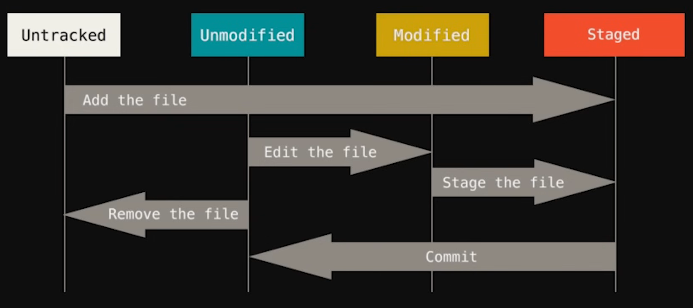
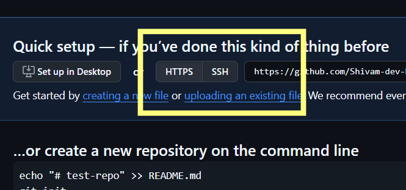

**GitHub**: A cloud platform to **store, manage, and collaborate on code using Git (version control)**.

---

## Table of Content

| S no. |                                                            Name                                                             | Importance |
| :---: | :-------------------------------------------------------------------------------------------------------------------------: | :--------: |
|   1   |                                                  Git Installation & Setup                                                   |    High    |
|   2   |                                                       Initialize Repo                                                       |    High    |
|   3   |                                                          Examples                                                           |    low     |
|   4   |                                                        Some Keywords                                                        |    low     |
|   5   |                                                  Different States of file                                                   |    low     |
|   6   |                                                        Commit Types                                                         |    Mid     |
|   7   | Commands<br>  1. status<br>    	2. checkout<br>     	3. .gitignore<br>	4. branch<br>	                 5. Private repository |    High    |
|   8   |                                                     Clone a repository                                                      |    low     |
|   9   |                                                            Other                                                            |    low     |

---
## Git Installation & Setup

- Download : [Click Me ](https://git-scm.com/install/windows) 
- Install
- First Time Git Setup
	1. Open Git Bash
	2. Linking with name and Email ID
		- ` git config --global user.name "Shivam Srivastava"`
		- ` git config --global user.email mypersonalishere.mypersonal@gmail.com`
	3. Check
		- `git config --global user.name`  :  ⇒ Shivam Srivastava
		- `git config --global user.email`

---
## Initialize Repo

- On Website 
	1. Add a new repo in GitHub, Copy the 
	2. `git remote add origin https://github.com/Shivam-dev-here/test-repo.git`
- Open file with Git bash
	 1. `git init`
	 2. `git add .`
	 3. `git commit -m"Docs: Initialize repo`
	 4. `git remote add origin https://github.com/Shivam-dev-here/dev-System.git`
	 5. `git push -u origin master`
	 6. Refer Example for future commits

---
## Example

```
git add -A
git commit -m "init: setup project with Node.js"

git add .
git commit -m "feat: implement fs readFile"

git add .
git commit -m "feat: implement fs writeFile"

git add .
git commit -m "feat: implement fs appendFile"

git add .
git commit -m "refactor: clean code and structure"

```

---
## Some Keywords

- Stages: ready these files for commit
- Commit: Declared the changes with it's Title

---
## Different States of file




---
## Commit types

- `feat` → new feature
- `fix` → bug fix
- `refactor` → improve code
- `docs` → documentation
- `test` → add/update tests
- `chore` → minor tasks (config, setup)
- `perf` → performance improvement

---
## Commands

##### `git add .`
- stages changes at onwards directory
##### `git add -A`
- stages changes 
##### `clear`
- cleans the terminal
##### `ls -lart`
- Shows all folders and file on current directory
##### `ls`
- Shows all files on current directory
##### `git commit -a -m"not a good practice"`
- skips staging and commits

---
##### ==`git status`==
1. Basic
	- after the last commit, does any changes occurred and what else "clean tree". 
	- Red: Non Staged files
	- Green: Ready to Commit 
	- Both Green and Red: g-last time staged file, r-new changes that aren't staged 
2. Advance

##### `git status -s`

<table>
  <tr>
    <th>S.No</th>
    <th>Name</th>
    <th>Definition</th>
  </tr>
  <tr>
    <td>1</td>
    <td><span style="color:red;">M</span></td>
    <td>Non Staged modified file</td>
  </tr>
  <tr>
    <td>2</td>
    <td><span style="color:green;">M</span></td>
    <td>Staged modified file</td>
  </tr>
  <tr><td>3</td>
    <td><span style="color:red;">M</span><span style="color:green;">M</span></td><td>File staged and after modified</td></tr></table>

---
##### ==`git checkout index.html`==
- Example
	1. Earlier: `git status`: tree clean
	2. After: "Someone updated my index.html"    ⇒   Complete Blunder
	3. Solution: `git checkout index.html`: Matched current directory with last commit
- For multiple files
	`git checkout -f`
	
---
##### ==`.gitignore`==

- ignore extension on entire repo  : ` *.env`
- ignore a file on entire repo          : ` mylogs.log`
- ignore a folder on entire repo     : ` mylogs/`
- ignore a folder from root            : `/node_modules/slug/`
---
##### ==`Git Branch`==
- Example: 
- Theory: master running a website with some bugs, feature1 fixed those issues 

- `git branch`   :  shows all branch
- `git branch feature1`    :   creates a new feature1 named branch
- `git checkout feature1` :   switch branch
- `git checkout -b feature2`  :  creates and switch branch
- `git merge feature1`     :  merges with current branch
---
##### ==`Private Repository`==
- Theory: won't be able to push or fetch for private, follow steps after creating a repo
	1. settings
	2. SSH and GPGs keys
	3. Generating SSH keys
	4. Generating a new SSH keys and adding it to the ssh-agent
	5. copy : `ssh-keygen -t ed25519 -C "your_email@example.com"`
	6. paste on bash with your email.
	7. paste on bash `eval "$(ssh-agent -s)"`
	8. outputs an agent pid
	9. paste on bash:  `ssh-add ~/.ssh/id_rsa`
	10.  paste on bash : `cat ~/.ssh/id_rsa.pub`
	11. Outputs content, Copy all   ---> let it be x1a
	12. Go to Setting > SSH and GPG keys > New SSH keys
	13. paste x1a and give a suitable title
	14. Go to your private repo and click on SSH 
	15. 
	16. copy the beside given URL, let it be x1b
	17. Git Bash : `git remote set-url origin x1b`
	18. Git Bash : `git push -u origin`
	19. Git Bash : `yes`

---
##### `git log`
- Shows all commit with committer, author and details
- Limited Commit `git log -p -6`  {6: last 6 commits}
- q: to exit
- `git log --oneline -n 5`: Shows only last 5 commit

##### `git diff`
- Compares working directory with Staged file
- Shows: Both old and new code
##### `git diff --staged`
- Compares working directory with last commit

##### `git rm --cached deleteme.md`
- Removes the file from Staging area

##### `git reset --soft HEAD~3`
- Revert commit before push

##### `git revert HEAD~2..HEAD`
- Revert commit after push

##### `git rm deleteme.md`
- Removes the file from Hard disk 

##### `touch about.html`
- creates a file

---
## Clone a Repository 
1. Create a folder and open with bash
2. GitHub > Copy the URL of repository that will be cloned, let it be x2a
3. Git Bash : `git clone x2a Shivam`

---
## Other

- Shortcut
	1. Activate window of Git bash
	2. `ctrl + +`: Zoom in
